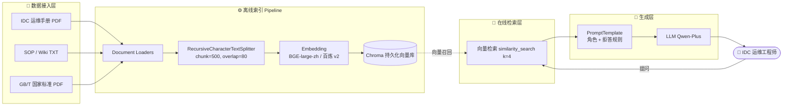

# 架构图 V1

> Mermaid 版可直接在 GitHub 渲染。后续可用 Excalidraw 画一版更精美的导出为 `arch_v1.png`。

```mermaid
flowchart LR
  subgraph DATA["📁 数据接入层"]
    PDF[IDC 运维手册 PDF]
    SOP[SOP / Wiki TXT]
    GBT[GB/T 国家标准 PDF]
  end

  subgraph INDEX["⚙️ 离线索引 Pipeline"]
    LOADER[Document Loaders]
    SPLITTER[RecursiveCharacterTextSplitter<br/>chunk=500, overlap=80]
    EMBED[Embedding<br/>BGE-large-zh / 百炼 v2]
    VS[(Chroma 持久化向量库)]
  end

  subgraph RETRIEVE["🔎 在线检索层"]
    VEC[向量检索 similarity_search k=4]
  end

  subgraph GEN["🧠 生成层"]
    PROMPT[PromptTemplate<br/>角色 + 拒答规则]
    LLM[LLM Qwen-Plus]
  end

  PDF & SOP & GBT --> LOADER --> SPLITTER --> EMBED --> VS
  USER([👤 IDC 运维工程师]) -->|提问| VEC
  VS -.向量召回.-> VEC
  VEC --> PROMPT --> LLM --> USER
```

> V1 是基础链路。W2 会加混合检索/Reranker/查询改写，W3 加 FastAPI 流式 + Docker，
> 详见 `docs/requirement.md` 的功能路线。
